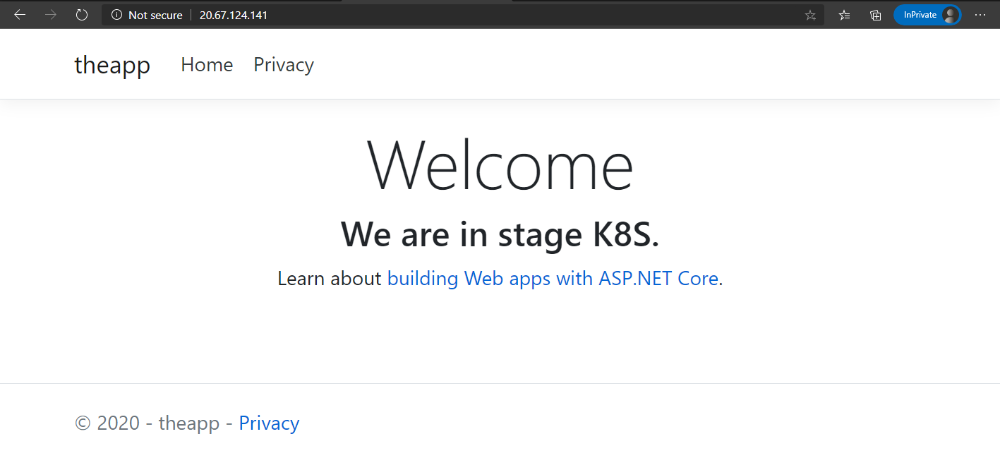
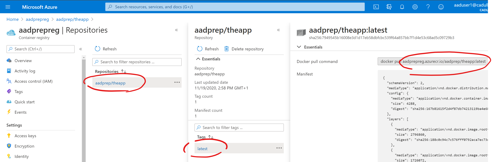
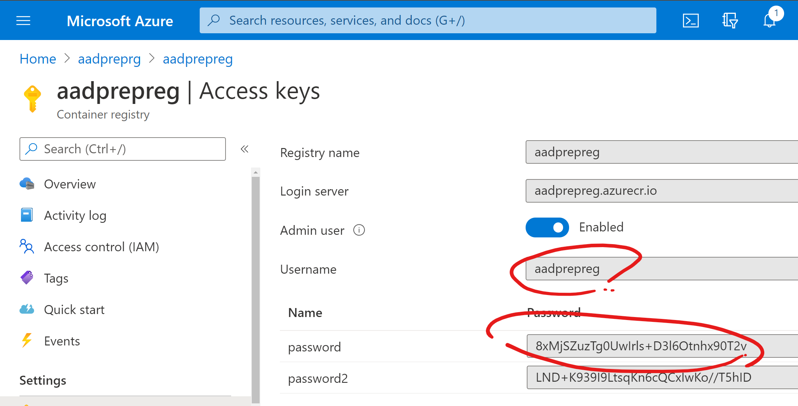
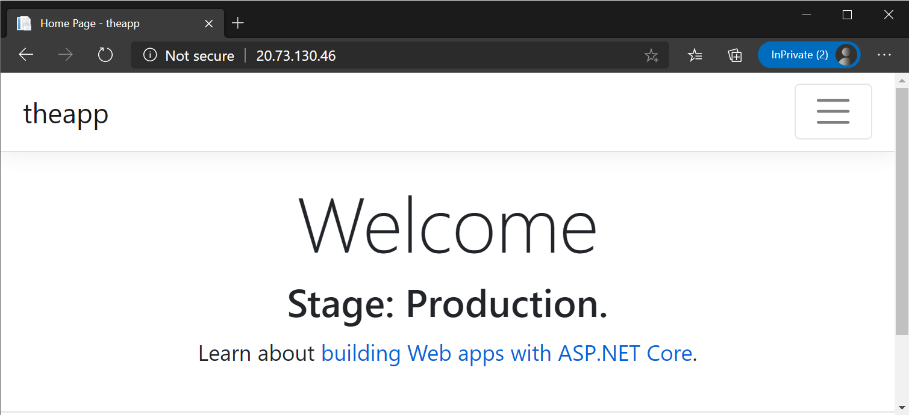

# aadprep

Some preparation samples for [Azure Adventure Day](https://aka.ms/azure-adventure-day),

It is always a good idea to carefully look at the all the code!

And to follow the instructions provided.

## Prepare

1. Optional (but might be a good idea for collaborating with others): [Import](https://docs.github.com/en/free-pro-team@latest/github/importing-your-projects-to-github/importing-a-repository-with-github-importer) or [fork](https://docs.github.com/en/free-pro-team@latest/github/getting-started-with-github/fork-a-repo) this repository into your own GitHub account.

1. Log on to cloud shell with the credentials provided.

1. Clone this repository (use the URL of your own account in case you forked or imported):
    ```sh
    git clone https://github.com/fabianmabasf/aadprep
    ```

## Deploy infrastructure and workload

1. Deploy our infrastructure:
    ```sh
    cd aadprep
    cd tf
    terraform init
    terraform apply --var "name_prefix=<some_name>" 
    ```
    Terraform will display the changes it will make and asks for your confirmation. Confirm with `yes` and the infrastructure will be deployed.

1. Get Kubernetes config and deploy our solution:
    ```sh
    cd ..
    cd k8s
    az aks get-credentials --name <some-name>aks --resource-group <some-name>rg
    kubectl apply -f theapp.yaml
    ```
1. Check our solution:
    ```sh
    kubectl get svc
    ```
    From the output of this, copy the external IP for our service and enter it in a web browser. That should then show you something like this:

    

## Change our workload

### Configure a setting through an environment variable.

1. First, assuming we are still in the `k8s` directory, open an editor (here, we are using `code theapp.yaml` to open the file directly in the cloud shell version of Visual Studio Code. You might as well use vi, nano or another editor of choice):

   ```sh
   code theapp.yaml
   ```

1. In the file, navigate to the container configuration:

   ```yaml
    spec:
      containers:
      - image: docker.io/cadull/theapp:latest
        imagePullPolicy: Always
        name: theapp
        env:
        - name: STAGE
          value: "K8S"
        resources:
          limits:
            memory: 200Mi
            cpu: "0.4" 
          requests:
            memory: 20Mi
            cpu: "0.04" 
   ```
   This configuration sets the environment variable `STAGE` to the value "K8S" (which you should have seen as the stage being displayed in the browser).

1. In the editor, change "K8S" to "Production" (or whatever you would like to see in the web page) and save the file (`Ctrl+S` works in VS Code).

   Then, apply the configuration again:

   ```sh
   kubectl apply -f theapp.yaml
   ```

   Because the configuration was changed, Kubernetes will now start exchanging the pods of our application one by one with the new config.
   
1. You can watch this happening:

   ```sh
   kubectl get pod --watch
   ```
   (and leave the watch using `Ctrl+C`)

   Once all pods are new, you can browse to our website again (the service IP you copied in one of the previous steps) and you should see the new label coming up.

### Change the application code and deploy a new container image

So far, the workload uses a static precompiled container image that is available from Docker Hub (`docker.io/cadull/theapp:latest`).

If we want to change more than just an environment variable, we need to build a new container image. For example, we might want to change the behaviour of an algorithm in our code, or simply change the text that presents our stage label.

A very handy way of doing this in Azure is to use the Azure Container Registry (ACR). That way, we do not need to acquire a Docker host machine (the cloud shell only contains the Docker client, it is not connected to a Docker daemon by default).

1. First, navigate to the directory containing our app's code and open an editor (here, we are using `code .` to open the whole directory in the cloud shell version of Visual Studio Code. You might as well use vi, nano or another editor of choice):

   ```sh
   cd ..
   cd theapp
   code .
   ```

1. In the editor, navigate to `theapp\Controllers\HomeController.cs`. In the file, locate the `Index` method:

   ```cs
        public IActionResult Index()
        {
            var stage = _configuration.GetValue<string>("STAGE", "N/A");
            ViewData["Message"] = $"We are in stage {stage}.";
            return View();
        }
   ```

1. Change `"We are in stage {stage}"` to `"Stage: {stage}"` to make the message more neutral (or do whatever fancy change you would like to do to this code).

   Build the image in ACR:

   ```sh
   az acr build -t aadprep/theapp:latest -r <some_name>reg .
   ```

   Where `<some_name>` needs to be replaced with the name you chose in the beginning, when deploying the infrastructure through Terraform (including an ACR that we will be using now).

   This builds the new container image directly in the ACR, and we can use it right away.
   
1. You can now navigate to your ACR in the Azure portal (most easily by entering the name in the search bar), select `Repository` in the menu on the left, click `aadprep/theapp` and then the `latest` tag:

   
  
   You can copy the name of the image from the portal for the next step.

1. To use the newly built image in our cluster, we need to change the configuration in `k8s/theapp.yaml` again. Find the place in the file, where the container image is defined (`image: docker.io/cadull/theapp:latest`) and change it to the name of our newly created image.

1. Apply the configuration again using `kubectl apply -f`.

1. Using `kubectl get pods`, you will most probably see that Kubernetes started the rolling upgrade, but got stuck after the first new pod was created and ran into an error (status `ImageErrorPull` or `ImagePullBackoff`):

   ```sh
   aaduser1@Azure:~$ kubectl get pod
   NAME                      READY   STATUS             RESTARTS   AGE
   theapp-6f4ccf5ffc-4npfg   0/1     ImagePullBackOff   0          7h2m
   theapp-94977c4f8-74j4c    1/1     Running            0          7h10m
   theapp-94977c4f8-r4tqm    1/1     Running            0          7h10m
   theapp-94977c4f8-z2h9m    1/1     Running            0          7h10m
   ```

   This way, our application still runs with the old configuration (no downtime), which is a good thing! But we need to figure out why our new image cannot be pulled from our beautiful container registry.

1. Use `kubectl describe pod <pod-name>` (where `<pod-name>` is the name of the bad pod) to find out more about this.

   At the very end of the pod's describe output, you should see a few events that describe how Kubernetes tried to get the pod running, but failed to pull the image, most probably because of an error like `unauthorized: authentication required`.

   This is because our registry allows no anonymous access and, while our cluster does have an identity, that identity is not yet allowed (has not been granted permission) to pull images from our registry.

   Another option here is that Kubernetes might not be able to find your image because of a wrong image name, in that case please double check the name you put into the yaml.

   In production use cases, to solve the issue with `unauthorized: authentication required`, we would grant permissions to our cluster's identity in the `IAM` section of the ACR in the Azure portal or using `az role assignment create`. In our case though, most probably our own account is not an owner of the subscription and thus cannot grant permissions on ACR. We will use a workaround instead: ACR offers an alternate authentication method called the [Admin Account](https://docs.microsoft.com/en-us/azure/container-registry/container-registry-authentication#admin-account).

1. Get the admin account information by browsing to your ACR and selecting `Access Keys`:

   

   Alternatively, you can get this directly in the shell:

   ```sh
   az acr credential show -n <registry-name>
   ```
1. We will now use the username and password as a so called [pull secret](https://kubernetes.io/docs/tasks/configure-pod-container/pull-image-private-registry/) in our configuration. We create the secret using `kubectl`:

   ```sh
   kubectl create secret docker-registry regcred --docker-server=<acr-name>.azurecr.io --docker-username=<acr-name> --docker-password=<password-you-copied> --docker-email=ignored@email.address
   ```

1. Now, to tell Kubernetes to use this secret for our container, add an `imagePullSecrets` section to the container spec in `k8s/theapp.yaml` (must be on the same level as `containers` and the name must be the one - `regcred` - under which we created the secret):

   ```yaml
    spec:
      imagePullSecrets:
      - name: regcred
      containers:
      - image: <acr-name>.azurecr.io/aadprep/theapp:latest
        imagePullPolicy: Always
        name: theapp
        env:
        - name: STAGE
          value: "Production"
        resources:
          limits:
            memory: 200Mi
            cpu: "0.4" 
          requests:
            memory: 20Mi
            cpu: "0.04" 
   ```
1. Apply the configuration again, wait for the pods to become replaced with the new image and browse to our website again. You should see our changes reflected in the browser:

   
